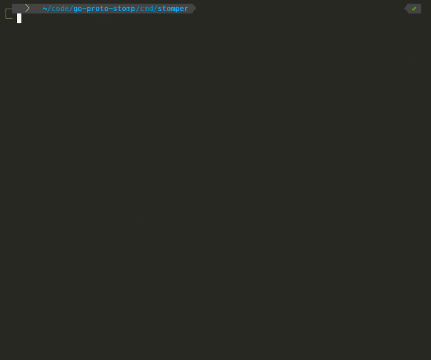

# go-proto-stomp


[](https://goreportcard.com/report/github.com/tjs-w/go-proto-stomp)


[](https://stomp.github.io/index.html)

**STOMP** stands for *Simple Text Oriented Messaging Protocol*

## STOMP Protocol Implementation in Golang (with interactive CLI)
[](https://pkg.go.dev/github.com/tjs-w/go-proto-stomp/)

Includes:
1. `stomper`: Interactive CLI for STOMP Client
2. `stompd`: STOMP Broker
3. `stomp`: STOMP Broker/Client Library

## stomper

```shell
stomper -t tcp
```



## stompd
Starting the STOMP Server/Broker:
```shell
stompd -t tcp <host> <port>
```

## stomp
Fetching the module:
```shell
go get -u github.com/tjs-w/go-proto-stomp
```
Importing the package:
```shell
import "github.com/tjs-w/go-proto-stomp/pkg/stomp"
```

## STOMP Library Documentation
*[Go Doc](https://pkg.go.dev/github.com/tjs-w/go-proto-stomp@v0.1.0/pkg/stomp)* lists the APIs for integrating both the 
STOMP Broker and Client.
## **[STOMP Protocol Specification](https://stomp.github.io/stomp-specification-1.2.html)**
The implementation adheres to the spec leaning towards the _version 1.2_ of the protocol.
### STOMP Frame: Augmented BNF Form
This implementation strictly follows the below grammar for frame construction and validation.
```
NULL                = <US-ASCII null (octet 0)>
LF                  = <US-ASCII line feed (aka newline) (octet 10)>
CR                  = <US-ASCII carriage return (octet 13)>
EOL                 = [CR] LF 
OCTET               = <any 8-bit sequence of data>

frame-stream        = 1*frame

frame               = command EOL
                      *( header EOL )
                      EOL
                      *OCTET
                      NULL
                      *( EOL )

command             = client-command | server-command

client-command      = "SEND"
                      | "SUBSCRIBE"
                      | "UNSUBSCRIBE"
                      | "BEGIN"
                      | "COMMIT"
                      | "ABORT"
                      | "ACK"
                      | "NACK"
                      | "DISCONNECT"
                      | "CONNECT"
                      | "STOMP"

server-command      = "CONNECTED"
                      | "MESSAGE"
                      | "RECEIPT"
                      | "ERROR"

header              = header-name ":" header-value
header-name         = 1*<any OCTET except CR or LF or ":">
header-value        = *<any OCTET except CR or LF or ":">
```
## License
MIT License

Copyright (c) 2022 Tejas Wanjari
